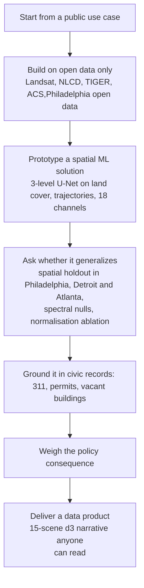

# Detecting urban decay and sprawl from Landsat in Philadelphia, Detroit and Atlanta, 2015 to 2025

I wanted to know whether a convolutional network trained on Landsat imagery could identify where a city is coming apart. Blight detection from satellites is a standing promise in planning analytics. Cities have limited demolition budgets and land banks with waiting lists, and a citywide map of where decline is accelerating would be useful to them.

The model works, in the narrow sense that it beats a spectral baseline on the decay class in two of three cities. Then I checked it against Philadelphia's own records, and the two disagree. Not weakly. The correlation between detected decay and recorded vacancy is negative across all spatial scales I tested, and it holds after controlling for the amount of building in each cell.

The deliverable alongside the paper is the [interactive site](https://cyber-hbliu.github.io/musa650-finalproject/): a 15-scene scrolling narrative with vector-change layers, per-tract choropleths that swap between satellite and municipal measures over identical geography, and hotspot data for block-group detail at zoom. **CLAUDE CODE HELPS ME WITH D3 WEB BUILDUP - ANIMATION, DEPLOYMENT, CODE REVIEW.**

## The problem

Cities measure blight through administrative records. From 2015 to 2025, Philadelphia alone had 298,608 vacancy-related 311 requests, 11,209 demolition permits, and 8,773 entries on its vacant building list, and each of these sources is shaped by who reports, who inspects, and what gets filed. Satellite land cover promises a consistent alternative that observes every block on the same terms. This project asks whether that promise holds at the rowhouse scale, where a 4-5 m facade occupies a tenth of a 30 m Landsat pixel.

Two kinds of change are at stake. New development is land converting to built cover inside city limits. Decay is developed land losing intensity. The question is whether a segmentation model trained on annual land cover trajectories can find the second kind where municipal records also see it.

## The approach

The work ran as a design loop rather than a straight pipeline. Each stage fed the next, and two stages sent the project back to an earlier one. An initial heat island framing was dropped once decay proved the sharper question, and raster PNG overlays on the web map were replaced with vector GeoJSON once zooming exposed their limits.

Labels come from USGS Annual NLCD Collection 1.2, with decay defined as a fall in median development intensity between 2015–2017 and 2023–2025. Imagery is Landsat Collection 2 surface reflectance, summer median composites for 2015 and 2025 built through the Planetary Computer STAC. The detector is a three-level U-Net evaluated on a 256-pixel checkerboard spatial holdout in Philadelphia and transferred frozen to Detroit and Atlanta, against difference-index spectral nulls and a global versus per-city normalisation ablation.

Validation then leaves the satellite entirely. Detected decay is compared with three independent municipal record systems at six aggregation scales from 90 m to 2.4 km, with rank correlations run both raw and controlling for built area. A block group extension joins eight ACS 2019–2023 variables and clusters detected decay pixels into named hotspots with DBSCAN, so the map can zoom from the city to the neighborhoods that carry the signal.

## The result

The detector clears its own checks. On decay it beats the spectral null in Philadelphia and Detroit, and the normalisation ablation catches a real failure mode, since global statistics inflate Detroit's predicted decay to 134.7 km² against 10.1 km² observed while per-city statistics bring it to 18.5. New development is the opposite case. The ΔNDBI null beats the U-Net in every city, so the site reports that class from the null rather than the model. Absolute precision stays low throughout, and a 28-patch training set limits how hard the model half of any claim can be pushed.

The validation is the finding. Detected decay correlates negatively with all three record systems at every scale, the correlation survives the built-area control, and it moves toward zero as the record type gets closer to a physical demolition. The block group extension repeats the pattern, with rank correlations against income, poverty, vacancy and unemployment all inside ±0.15. The four largest detected hotspots fall in 9800-series census tracts, the special land-use codes for industrial and airport land, not in residential neighborhoods. Read together, the satellite is not seeing disinvestment and inverting it. It is not seeing disinvestment at all, because the object that decays is an order of magnitude smaller than the pixel. Thirty-metre annual land cover is not a valid instrument for rowhouse-scale decline, and the detector's checks are what make that a credible negative result rather than a broken model.

Data comes from Landsat Collection 2 Level 2 via Microsoft Planetary Computer, USGS Annual NLCD Collection 1.2 via the MRLC GeoServer, US Census TIGER/Line 2024 and ACS 2019–2023, and the City of Philadelphia's Carto and ArcGIS open data endpoints for 311 requests, demolition permits and the vacant building inventory.

