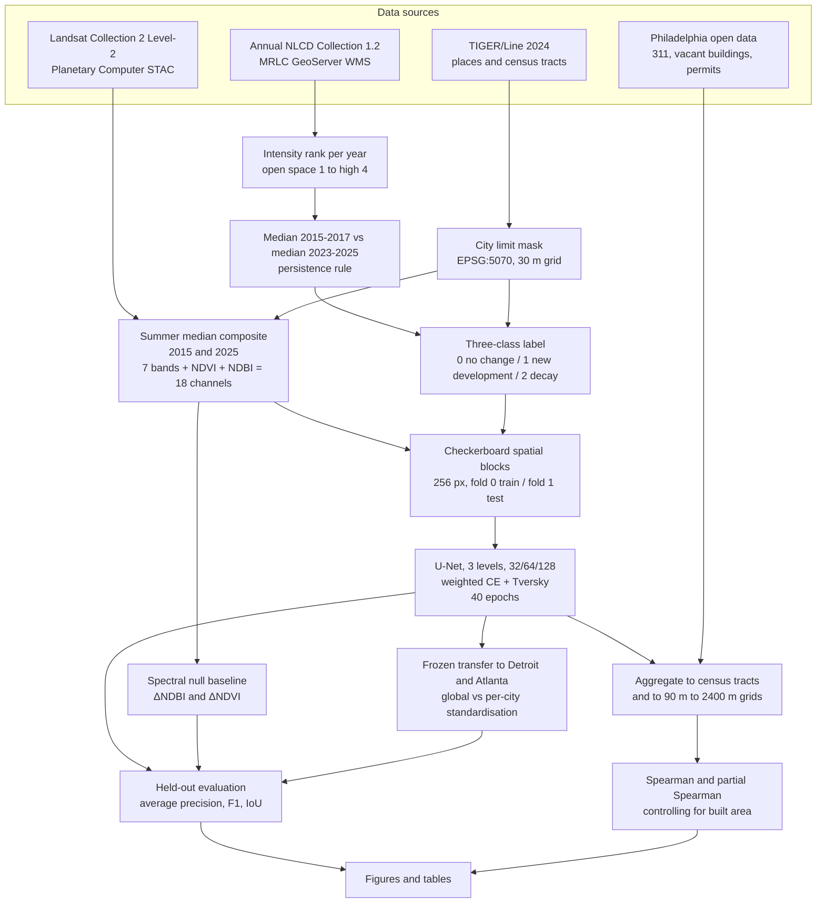

# Detecting urban decay and new development from Landsat in Philadelphia, Detroit and Atlanta, 2015 to 2025

I wanted to know whether a convolutional network trained on Landsat imagery could identify where a city is coming apart. Blight detection from satellites is a standing promise in planning analytics. Cities have limited demolition budgets and land banks with waiting lists, and a citywide map of where decline is accelerating would be useful to them.

The model works, in the narrow sense that it beats a spectral baseline on the decay class in two of three cities. Then I checked it against Philadelphia's own records, and the two disagree. Not weakly. The correlation between detected decay and recorded vacancy is negative at every spatial scale I tested, and it holds after controlling for the amount of building in each cell.

## Workflow

